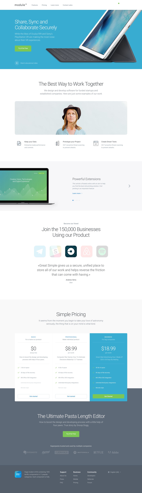

# Front-end Developer Test Project

## Project brief

Convert the following designs to HTML/CSS/JS.

## Requirements

1. Create project using [PX2HT Generator](https://github.com/Pixel2HTML/pixel2html-generator)
2. You should use SASS, LESS or Stylus.
3. Make it responsive by your best judgement.
4. You should use [Slick.js](http://kenwheeler.github.io/slick/) for any 
carousel on the page.

### Bonus Tasks
1. Code the HTML using Jade as template engine.
2. Use [BEM methodology](https://en.bem.info/methodology/) and break the site 
into modules.

## Download PSD / Sketch

## Supported browsers

Ensure that the elements work and display correctly in the following browsers 
and OS devises:

- Firefox       (latest version)
- Google Chrome (latest version)
- Safari        (latest version)
- Microsoft Edge
- Internet Explorer 11

- Safari (iOS 9.0)
- Chrome (Android 5.0)

## Project delivery structure

~~~
├── dist
|   ├── images           # Images
|   ├── stylesheets      # Global styles
|   |   └── main.css     # Main stylesheet (import everything to this file)
|   |   └── main.min.css # Minified version of the main stylesheet
|   ├── javascript       # Global scripts, base classes, etc
|   |   └── main.js      # Main javascript file
|   |   └── main.min.js  # Minified version of the main javascript file
|   ├── fonts            # Fonts 
|   ├── index.html       # Screen template
~~~

## The test needs to answer this questions

1. Are all required pages / states developed?
2. Are all requirements met? 
3. Do pages display and work correctly in supported browsers? 
4. Do pages display and work correctly in supported OS devices? 
5. Is reasonable pixel precision achieved?
6. Do pages work without JavaScript errors?

## Deliverables

- The files should be pushed to your Github account, if you don't have one you can
follow this link: https://github.com/join to get one, it's free!
- Cross-check all the details before pushing the final code for review.
- Track the time you spend (You can use [TOGGL](https://www.toggl.com/) for this, be honest :D)

## Links

Here are some links that might be helpful:

- [Automating Tasks with GulpJS](https://scotch.io/tutorials/automate-your-tasks-easily-with-gulp-js)
- [CSSComb](https://github.com/csscomb/csscomb.js)
- [UnCSS](https://github.com/giakki/uncss)
- [How to use CSS Stats to check your code](http://webdesign.tutsplus.com/tutorials/understanding-css-stats-how-to-make-the-most-of-the-numbers--cms-22756)

## Questions?

Fear not! You can send us an email to Diego [(diego@pixel2html.com)](mailto:diego@pixel2html.com)
or Juan Manuel [(jm@pixel2html.com)](mailto:jm@pixel2html.com) with the subject: 
_'Front-end Test Project'_.

Happy Coding!

