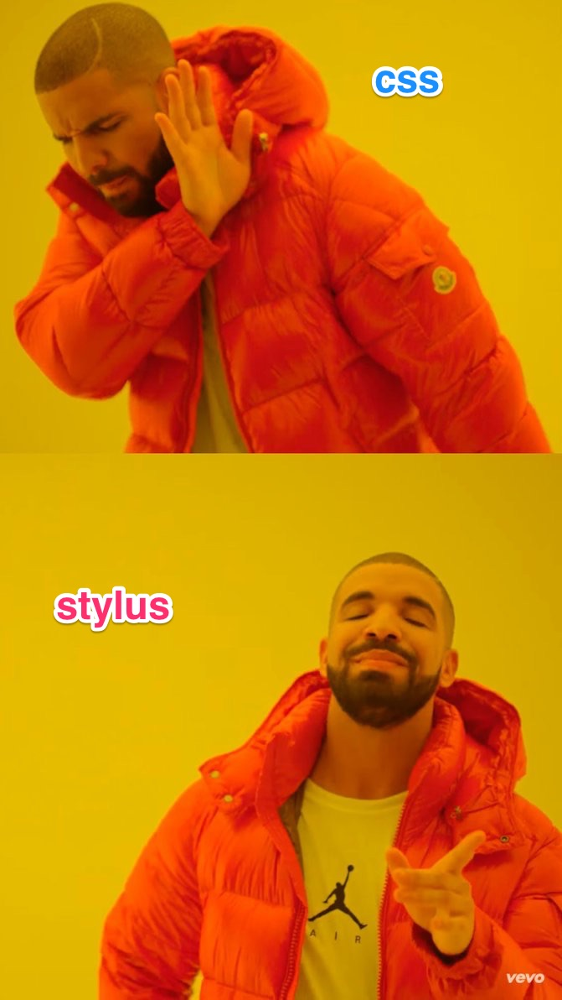

# px2html-demo
pixel2html test

- Scaffold done with [pixel2html generator](https://github.com/Pixel2HTML/pixel2html-generator)
- Run npm install
- Gulp serve
- Go to localhost:3000

# no Slick.js, Unslider.js instead :)
Instead of slick.js [used unslider.js](http://unslider.com/) because slick seems outdated and a bit ugly tbh. Unslider seemed to be easier to implement and customize.

# SVGs ftw!
Most of the images used are SVG for retina compatibility and compressed for better network performance.

# Well...

<<<<<<< HEAD
1. Make it responsive by your best judgement.
2. The site should be retina compatible.
3. Do not use any image, everything should be made using CSS3. The only images 
allowed are logos or photos.
4. The header should be stick to the top of the viewport. We recommend you to 
use [Slick.js](http://kenwheeler.github.io/slick/) for any carousel on the page. 
If you want to use another library because you think it's better you have to 
explain us why :)
=======
# HTML?
Nope, I prefer precompilers, make things easier for small projects (imo).
This one was made with Jade (currently known as pug, but since I don't like its new name I just npm'ed jade instead).
>>>>>>> e4354ac969a8c01d0c698e8d03e330b062b13c40

